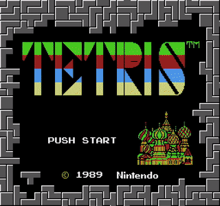

# znes - Zac's NES

A cycle accurate emulation of the classic [Nintendo Entertainment System](https://en.wikipedia.org/wiki/Nintendo_Entertainment_System). Plays over **1000** games!

| [ Super Mario Bros.](https://en.wikipedia.org/wiki/Super_Mario_Bros.) | [ Tetris](https://en.wikipedia.org/wiki/Tetris_(NES_video_game)) | [ The Legend of Zelda](https://en.wikipedia.org/wiki/The_Legend_of_Zelda_(video_game)) |
|:---:|:---:|:---:|
| [ **DuckTales**](https://en.wikipedia.org/wiki/DuckTales_(video_game)) | [ **Choujin Sentai Jetman**](https://en.wikipedia.org/wiki/Ch%C5%8Djin_Sentai_Jetman#Video_game) | [ **Castlevania**](https://en.wikipedia.org/wiki/Castlevania_(1986_video_game)) |

## Build and Usage
For now, to run znes you'll need `cargo` and `SDL2`. Installation instructions for the Rust toolchain can be found [here](https://www.rust-lang.org/tools/install), and consult your distro's repositories for `SDL2`.

Use `cargo` to build the project:
```
cargo build --release
```
The binary can then be found in `./target/release/znes`. Znes uses `clap` to handle command line arguments. It expects the directory of an NES rom (absolute or relative), followed by optional arguments. Running with the `-h` flag will display the options.
```
USAGE:
    znes [FLAGS] [OPTIONS] <file>

ARGS:
    <file>    The .nes file to be ran by the emulator

FLAGS:
    -d               Turn debugging information on
    -h, --help       Prints help information
    -V, --version    Prints version information

OPTIONS:
    -s <scale>        Resolution scaling factor, defaults to 3
```
The debugging flag will turn on CPU profiling and save the profile to `./znes.profile`. You can use Google's [pprof](https://github.com/google/pprof) for analysis.

The control scheme uses the following keys:
```
Z - (A)
X - (B)
Backspace - (Select)
Enter - (Start)
Up - (Up)
Down - (Down)
Left - (Left)
Right - (Right)
Space - Toggle pause
```

## About

After making my [Chip8 emulator](https://github.com/ZacJoffe/chip8-emulator) at the end of last year, I wanted to work on something more complicated and challenging. And this project was undoubtedly the hardest I've ever worked on. Even though the NES is a relatively simple machine, the components are still incredibly complex and nuanced, especially when compared to the aforementioned Chip8. In order for a working emulator, you need to accurately emulate most of the internal hardware of the NES - even small bugs can render an emulator completely broken.

Like with my Chip8 emulator, I wrote znes in Rust. It's quickly become my favorite language, and even though it causes the occasional headache, I'm sure I avoided many bugs that I would have encountered if I wrote it in C or C++. I'll continue using Rust for future projects.

What made this project possible was the unmatched efforts of the incredible NES community. The [Nesdev Wiki](https://wiki.nesdev.com/w/index.php/Nesdev_Wiki) details everything that you could possibly need for this project, so you won't need to rummage through hardware manuals from the 1980s to understand the inner workings of the machine. [One Lone Coder's NES series](https://www.youtube.com/watch?v=nViZg02IMQo&list=PLrOv9FMX8xJHqMvSGB_9G9nZZ_4IgteYf) was also paramount to being able to fully understand the hardware. Additionally, thanks to [Folgeman's emulator](https://github.com/fogleman/nes), [nestur](https://github.com/spieglt/nestur), and [LaiNES](https://github.com/AndreaOrru/LaiNES) for being great references throughout development. And last but not least, special thanks to my friends [Thomas George](https://github.com/t6george) and [Daniel Prilik](https://github.com/daniel5151), for convincing me to go through with this project. Their emulators, [NESS](https://github.com/t6george/NESS) and [ANESE](https://github.com/daniel5151/ANESE) were also great resources and served as inspiration for the project.

## Goals
The code could be optimized further for better performance. I'd like to do some more cleanup and implement more mappers. Currently, Mappers 0-3 are implemented which covers around 70% of games according to [this list](http://tuxnes.sourceforge.net/nesmapper.txt). Additionally, I haven't implemented the APU, which is probably the highest priority at this point.

I'll also look into deploying this project to the web using [WebAssembly](https://webassembly.org/).
